# D-Query AI Email Automation System - System Design Document

## Table of Contents
1. [System Overview](#1-system-overview)
2. [Architecture Design](#2-architecture-design)
3. [Component Breakdown](#3-component-breakdown)
4. [Data Design](#4-data-design)
5. [Technology Stack](#5-technology-stack)
6. [System Workflows](#6-system-workflows)
7. [API Design](#7-api-design)
8. [Security & Performance](#8-security--performance)
9. [Deployment Architecture](#9-deployment-architecture)
10. [Monitoring & Maintenance](#10-monitoring--maintenance)

---

## 1. System Overview

### 1.1 Purpose
The D-Query AI Email Automation System is an intelligent email processing platform designed to automatically handle educational institution queries using advanced AI technologies including fine-tuned language models, Retrieval-Augmented Generation (RAG), and multi-agent orchestration.

### 1.2 Key Features
- **Intelligent Email Classification**: Fine-tuned BERT models for query categorization
- **Retrieval-Augmented Generation**: Context-aware responses using institutional knowledge base
- **Multi-Agent Architecture**: Specialized agents for different processing stages
- **Gemini AI Integration**: Advanced filtering and response generation
- **Real-time Dashboard**: Streamlit-based monitoring and control interface
- **RESTful API**: FastAPI-based backend for system integration
- **Automated Workflows**: Configurable automation rules and thresholds

### 1.3 System Goals
- **Accuracy**: >85% correct response classification
- **Automation Rate**: >60% auto-response capability
- **Response Time**: <5 minutes average processing time
- **Scalability**: Handle 1000+ emails per day
- **Reliability**: 99.5% uptime with failover mechanisms

---

## 2. Architecture Design

### 2.1 High-Level System Architecture

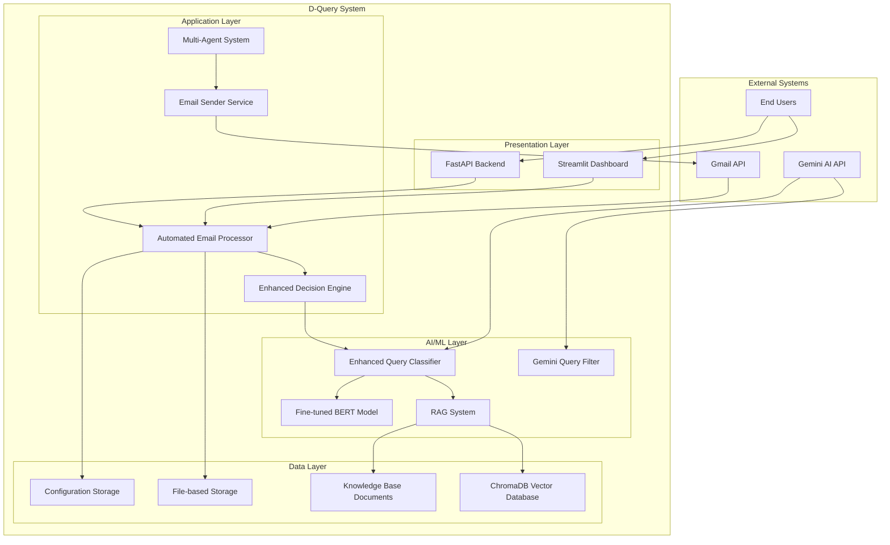
```mermaid
graph TB
    subgraph "External Systems"
        Gmail[Gmail API]
        Gemini[Gemini AI API]
        Users[End Users]
    end
    
    subgraph "D-Query System"
        subgraph "Presentation Layer"
            Dashboard[Streamlit Dashboard]
            API[FastAPI Backend]
        end
        
        subgraph "Application Layer"
            Processor[Automated Email Processor]
            DecisionEngine[Enhanced Decision Engine]
            MultiAgent[Multi-Agent System]
            EmailSender[Email Sender Service]
        end
        
        subgraph "AI/ML Layer"
            Classifier[Enhanced Query Classifier]
            RAG[RAG System]
            FineTuned[Fine-tuned BERT Model]
            GeminiFilter[Gemini Query Filter]
        end
        
        subgraph "Data Layer"
            VectorDB[ChromaDB Vector Database]
            FileStorage[File-based Storage]
            KnowledgeBase[Knowledge Base Documents]
            ConfigDB[Configuration Storage]
        end
    end
    
    Users --> Dashboard
    Users --> API
    Gmail --> Processor
    Gemini --> GeminiFilter
    Gemini --> Classifier
    
    Dashboard --> Processor
    API --> Processor
    Processor --> DecisionEngine
    DecisionEngine --> Classifier
    Classifier --> RAG
    Classifier --> FineTuned
    RAG --> VectorDB
    RAG --> KnowledgeBase
    
    MultiAgent --> EmailSender
    EmailSender --> Gmail
    
    Processor --> FileStorage
    Processor --> ConfigDB
```

### 2.2 System Architecture Layers

#### 2.2.1 Presentation Layer
- **Streamlit Dashboard**: Real-time monitoring, control, and analytics interface
- **FastAPI Backend**: RESTful API for external system integration

#### 2.2.2 Application Layer
- **Automated Email Processor**: Core orchestration component
- **Enhanced Decision Engine**: Business logic and automation rules
- **Multi-Agent System**: Specialized processing agents
- **Email Sender Service**: Gmail API integration for sending responses

#### 2.2.3 AI/ML Layer
- **Enhanced Query Classifier**: Fine-tuned BERT model for classification
- **RAG System**: Context-aware response generation
- **Gemini Query Filter**: Advanced AI filtering and response enhancement
- **Fine-tuned Model**: Custom-trained language model for institution-specific queries

#### 2.2.4 Data Layer
- **ChromaDB**: Vector database for semantic document retrieval
- **File-based Storage**: Email processing logs and configuration
- **Knowledge Base**: PDF documents and institutional information
- **Configuration Storage**: System settings and automation rules

---

## 3. Component Breakdown

### 3.1 Core Components

#### 3.1.1 Automated Email Processor
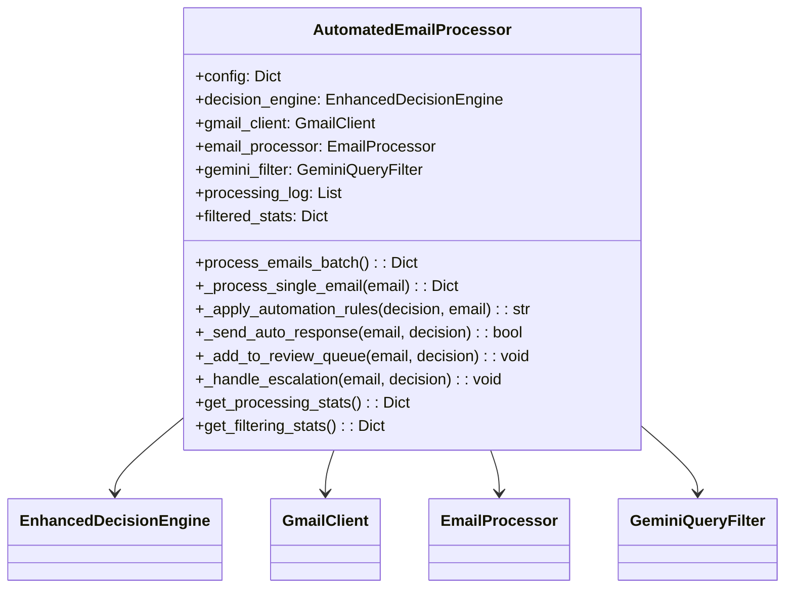
```mermaid
classDiagram
    class AutomatedEmailProcessor {
        +config: Dict
        +decision_engine: EnhancedDecisionEngine
        +gmail_client: GmailClient
        +email_processor: EmailProcessor
        +gemini_filter: GeminiQueryFilter
        +processing_log: List
        +filtered_stats: Dict
        
        +process_emails_batch(): Dict
        +_process_single_email(email): Dict
        +_apply_automation_rules(decision, email): str
        +_send_auto_response(email, decision): bool
        +_add_to_review_queue(email, decision): void
        +_handle_escalation(email, decision): void
        +get_processing_stats(): Dict
        +get_filtering_stats(): Dict
    }
    
    AutomatedEmailProcessor --> EnhancedDecisionEngine
    AutomatedEmailProcessor --> GmailClient
    AutomatedEmailProcessor --> EmailProcessor
    AutomatedEmailProcessor --> GeminiQueryFilter
```

#### 3.1.2 Enhanced Query Classifier
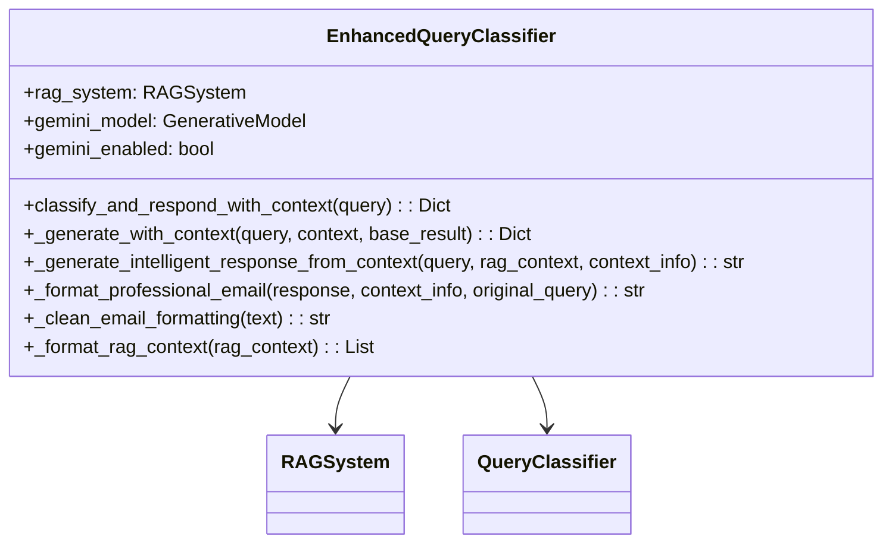
```mermaid
classDiagram
    class EnhancedQueryClassifier {
        +rag_system: RAGSystem
        +gemini_model: GenerativeModel
        +gemini_enabled: bool
        
        +classify_and_respond_with_context(query): Dict
        +_generate_with_context(query, context, base_result): Dict
        +_generate_intelligent_response_from_context(query, rag_context, context_info): str
        +_format_professional_email(response, context_info, original_query): str
        +_clean_email_formatting(text): str
        +_format_rag_context(rag_context): List
    }
    
    EnhancedQueryClassifier --> RAGSystem
    EnhancedQueryClassifier --> QueryClassifier
```

#### 3.1.3 RAG System
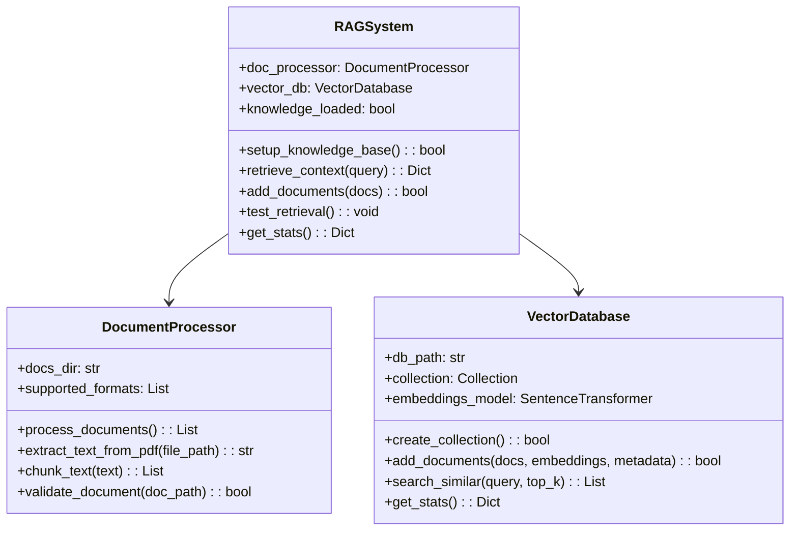
```mermaid
classDiagram
    class RAGSystem {
        +doc_processor: DocumentProcessor
        +vector_db: VectorDatabase
        +knowledge_loaded: bool
        
        +setup_knowledge_base(): bool
        +retrieve_context(query): Dict
        +add_documents(docs): bool
        +test_retrieval(): void
        +get_stats(): Dict
    }
    
    class DocumentProcessor {
        +docs_dir: str
        +supported_formats: List
        
        +process_documents(): List
        +extract_text_from_pdf(file_path): str
        +chunk_text(text): List
        +validate_document(doc_path): bool
    }
    
    class VectorDatabase {
        +db_path: str
        +collection: Collection
        +embeddings_model: SentenceTransformer
        
        +create_collection(): bool
        +add_documents(docs, embeddings, metadata): bool
        +search_similar(query, top_k): List
        +get_stats(): Dict
    }
    
    RAGSystem --> DocumentProcessor
    RAGSystem --> VectorDatabase
```

#### 3.1.4 Multi-Agent System
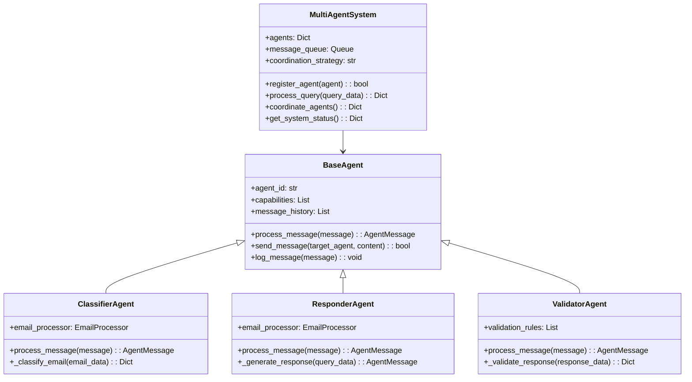
```mermaid
classDiagram
    class MultiAgentSystem {
        +agents: Dict
        +message_queue: Queue
        +coordination_strategy: str
        
        +register_agent(agent): bool
        +process_query(query_data): Dict
        +coordinate_agents(): Dict
        +get_system_status(): Dict
    }
    
    class BaseAgent {
        +agent_id: str
        +capabilities: List
        +message_history: List
        
        +process_message(message): AgentMessage
        +send_message(target_agent, content): bool
        +log_message(message): void
    }
    
    class ClassifierAgent {
        +email_processor: EmailProcessor
        
        +process_message(message): AgentMessage
        +_classify_email(email_data): Dict
    }
    
    class ResponderAgent {
        +email_processor: EmailProcessor
        
        +process_message(message): AgentMessage
        +_generate_response(query_data): AgentMessage
    }
    
    class ValidatorAgent {
        +validation_rules: List
        
        +process_message(message): AgentMessage
        +_validate_response(response_data): Dict
    }
    
    MultiAgentSystem --> BaseAgent
    BaseAgent <|-- ClassifierAgent
    BaseAgent <|-- ResponderAgent
    BaseAgent <|-- ValidatorAgent
```

### 3.2 Integration Components

#### 3.2.1 Gmail Integration
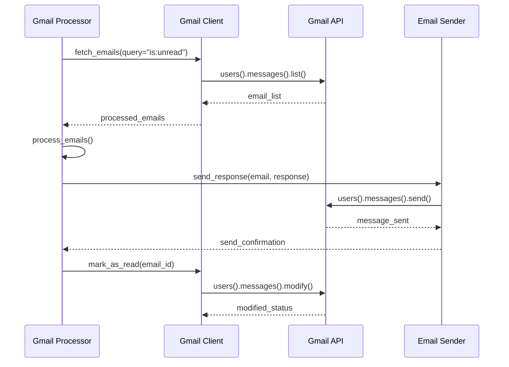
```mermaid
sequenceDiagram
    participant GP as Gmail Processor
    participant GC as Gmail Client
    participant GA as Gmail API
    participant ES as Email Sender
    
    GP->>GC: fetch_emails(query="is:unread")
    GC->>GA: users().messages().list()
    GA-->>GC: email_list
    GC-->>GP: processed_emails
    
    GP->>GP: process_emails()
    
    GP->>ES: send_response(email, response)
    ES->>GA: users().messages().send()
    GA-->>ES: message_sent
    ES-->>GP: send_confirmation
    
    GP->>GC: mark_as_read(email_id)
    GC->>GA: users().messages().modify()
    GA-->>GC: modified_status
```

#### 3.2.2 Gemini AI Integration
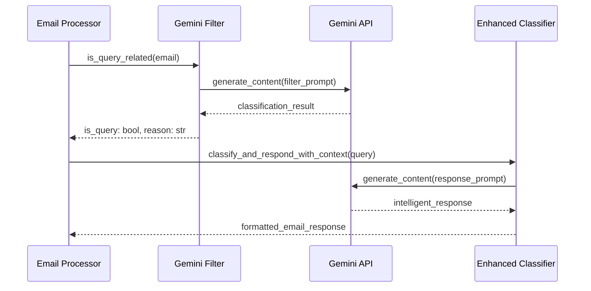
```mermaid
sequenceDiagram
    participant EP as Email Processor
    participant GF as Gemini Filter
    participant GA as Gemini API
    participant EC as Enhanced Classifier
    
    EP->>GF: is_query_related(email)
    GF->>GA: generate_content(filter_prompt)
    GA-->>GF: classification_result
    GF-->>EP: is_query: bool, reason: str
    
    EP->>EC: classify_and_respond_with_context(query)
    EC->>GA: generate_content(response_prompt)
    GA-->>EC: intelligent_response
    EC-->>EP: formatted_email_response
```

---

## 4. Data Design

### 4.1 Data Models

#### 4.1.1 Email Data Model
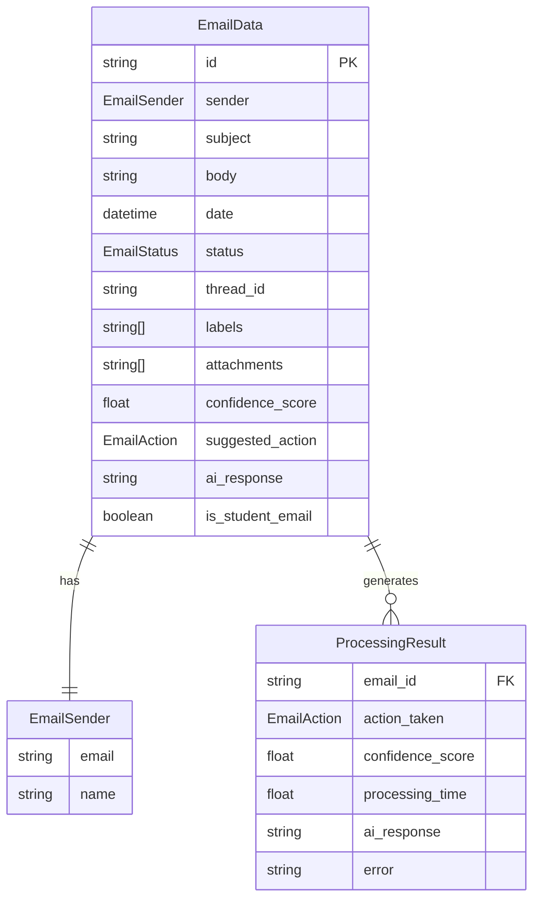
```mermaid
erDiagram
    EmailData {
        string id PK
        EmailSender sender
        string subject
        string body
        datetime date
        EmailStatus status
        string thread_id
        string[] labels
        string[] attachments
        float confidence_score
        EmailAction suggested_action
        string ai_response
        boolean is_student_email
    }
    
    EmailSender {
        string email
        string name
    }
    
    ProcessingResult {
        string email_id FK
        EmailAction action_taken
        float confidence_score
        float processing_time
        string ai_response
        string error
    }
    
    EmailData ||--|| EmailSender : has
    EmailData ||--o{ ProcessingResult : generates
```

#### 4.1.2 Configuration Data Model
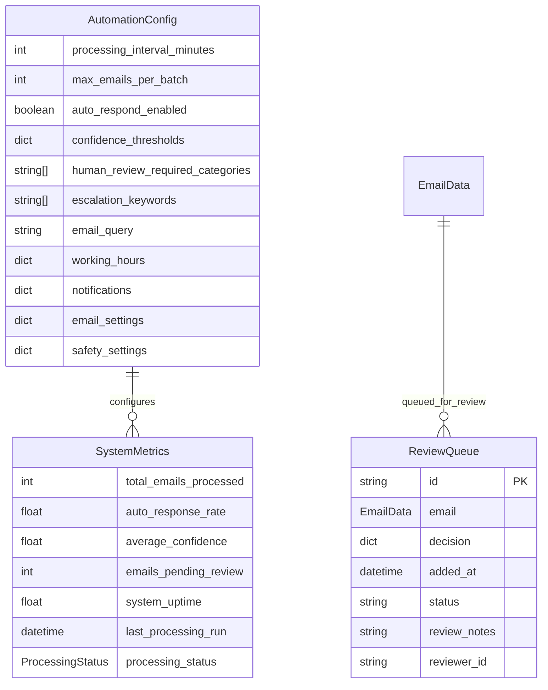
```mermaid
erDiagram
    AutomationConfig {
        int processing_interval_minutes
        int max_emails_per_batch
        boolean auto_respond_enabled
        dict confidence_thresholds
        string[] human_review_required_categories
        string[] escalation_keywords
        string email_query
        dict working_hours
        dict notifications
        dict email_settings
        dict safety_settings
    }
    
    SystemMetrics {
        int total_emails_processed
        float auto_response_rate
        float average_confidence
        int emails_pending_review
        float system_uptime
        datetime last_processing_run
        ProcessingStatus processing_status
    }
    
    ReviewQueue {
        string id PK
        EmailData email
        dict decision
        datetime added_at
        string status
        string review_notes
        string reviewer_id
    }
    
    AutomationConfig ||--o{ SystemMetrics : configures
    EmailData ||--o{ ReviewQueue : queued_for_review
```

### 4.2 Vector Database Schema

#### 4.2.1 Document Storage
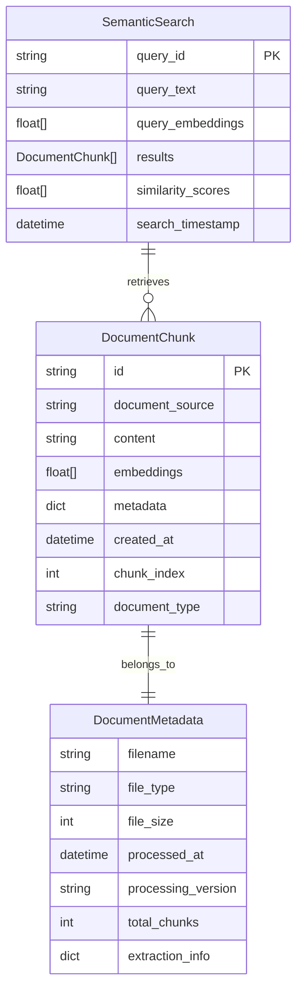
```mermaid
erDiagram
    DocumentChunk {
        string id PK
        string document_source
        string content
        float[] embeddings
        dict metadata
        datetime created_at
        int chunk_index
        string document_type
    }
    
    DocumentMetadata {
        string filename
        string file_type
        int file_size
        datetime processed_at
        string processing_version
        int total_chunks
        dict extraction_info
    }
    
    SemanticSearch {
        string query_id PK
        string query_text
        float[] query_embeddings
        DocumentChunk[] results
        float[] similarity_scores
        datetime search_timestamp
    }
    
    DocumentChunk ||--|| DocumentMetadata : belongs_to
    SemanticSearch ||--o{ DocumentChunk : retrieves
```

### 4.3 Data Flow Architecture

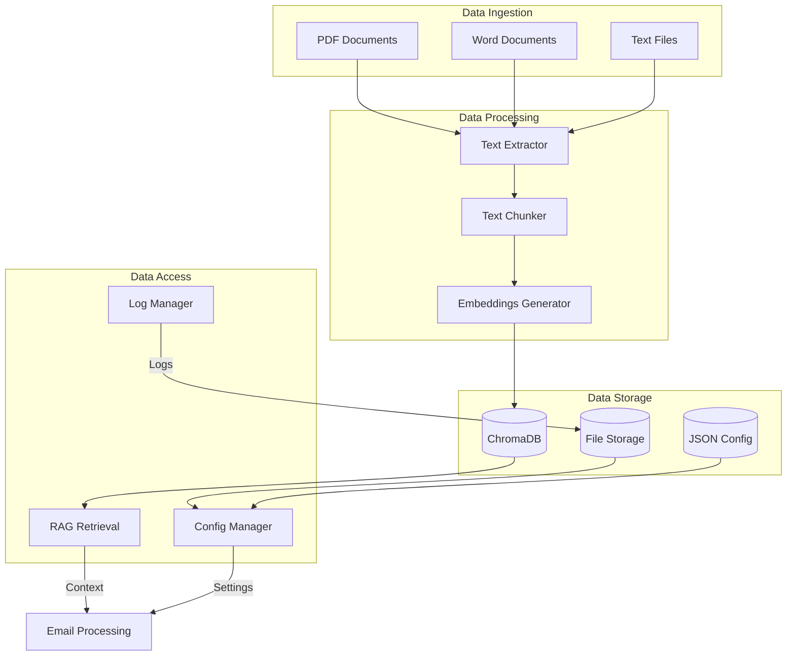
```mermaid
flowchart TD
    subgraph "Data Ingestion"
        PDF[PDF Documents]
        DOCX[Word Documents]
        TXT[Text Files]
    end
    
    subgraph "Data Processing"
        Extractor[Text Extractor]
        Chunker[Text Chunker]
        Embedder[Embeddings Generator]
    end
    
    subgraph "Data Storage"
        VectorDB[(ChromaDB)]
        FileStore[(File Storage)]
        ConfigStore[(JSON Config)]
    end
    
    subgraph "Data Access"
        RAGRetrieval[RAG Retrieval]
        ConfigManager[Config Manager]
        LogManager[Log Manager]
    end
    
    PDF --> Extractor
    DOCX --> Extractor
    TXT --> Extractor
    
    Extractor --> Chunker
    Chunker --> Embedder
    Embedder --> VectorDB
    
    VectorDB --> RAGRetrieval
    FileStore --> ConfigManager
    ConfigStore --> ConfigManager
    
    RAGRetrieval --> |Context| EmailProcessing[Email Processing]
    ConfigManager --> |Settings| EmailProcessing
    LogManager --> |Logs| FileStore
```

---

## 5. Technology Stack

### 5.1 Core Technologies and Justifications

#### 5.1.1 Backend Technologies

| Technology | Purpose | Justification |
|------------|---------|---------------|
| **Python 3.11** | Core Language | • Excellent AI/ML ecosystem<br>• Rich libraries for NLP<br>• Fast prototyping and development<br>• Strong community support |
| **FastAPI** | REST API Framework | • High performance (async/await)<br>• Automatic API documentation<br>• Type hints integration<br>• Modern Python features support |
| **Streamlit** | Dashboard Framework | • Rapid prototyping for data apps<br>• Built-in components for ML dashboards<br>• Python-native (no separate frontend)<br>• Real-time updates and interactivity |

#### 5.1.2 AI/ML Technologies

| Technology | Purpose | Justification |
|------------|---------|---------------|
| **PyTorch** | Deep Learning Framework | • Dynamic computation graphs<br>• Excellent for research and production<br>• Strong NLP model support<br>• HuggingFace integration |
| **Transformers** | Pre-trained Models | • State-of-the-art NLP models<br>• Easy fine-tuning capabilities<br>• BERT, GPT model support<br>• Industry standard for text classification |
| **LangChain** | LLM Framework | • RAG implementation simplicity<br>• Multiple LLM provider support<br>• Chain-of-thought processing<br>• Document processing utilities |
| **ChromaDB** | Vector Database | • Open-source and lightweight<br>• Excellent Python integration<br>• Efficient similarity search<br>• Easy deployment and scaling |
| **Sentence Transformers** | Text Embeddings | • High-quality embeddings<br>• Semantic similarity focus<br>• Pre-trained models available<br>• Optimized for retrieval tasks |

#### 5.1.3 External AI Services

| Service | Purpose | Justification |
|---------|---------|---------------|
| **Google Gemini AI** | Advanced Text Generation | • State-of-the-art reasoning<br>• Context-aware responses<br>• Reliable API performance<br>• Cost-effective for production |
| **Gmail API** | Email Integration | • Official Google integration<br>• Secure OAuth authentication<br>• Comprehensive email operations<br>• Rate limiting and reliability |

#### 5.1.4 Data Processing Technologies

| Technology | Purpose | Justification |
|------------|---------|---------------|
| **PyMuPDF** | PDF Processing | • Fast PDF text extraction<br>• Handles complex layouts<br>• Python-native integration<br>• Reliable for academic documents |
| **python-docx** | Word Document Processing | • Native .docx support<br>• Preserves formatting information<br>• Easy integration with text processing<br>• Handles institutional documents |
| **Pandas** | Data Analysis | • Data manipulation and analysis<br>• Excel integration capabilities<br>• Statistical operations<br>• Visualization support |

### 5.2 Architecture Decision Records (ADRs)

#### 5.2.1 ADR-001: Multi-Agent Architecture
**Status**: Accepted  
**Context**: Need flexible, scalable processing pipeline  
**Decision**: Implement multi-agent system for specialized processing  
**Consequences**: 
- ✅ Better separation of concerns
- ✅ Easier testing and debugging
- ✅ Scalable processing pipeline
- ⚠️ Additional complexity in coordination

#### 5.2.2 ADR-002: RAG over Pure Fine-tuning
**Status**: Accepted  
**Context**: Need accurate, up-to-date institutional information  
**Decision**: Combine fine-tuned models with RAG system  
**Consequences**:
- ✅ Always current information
- ✅ Explainable responses with sources
- ✅ No need for frequent model retraining
- ⚠️ Additional infrastructure complexity

#### 5.2.3 ADR-003: Streamlit for Dashboard
**Status**: Accepted  
**Context**: Need rapid development of monitoring interface  
**Decision**: Use Streamlit instead of React/Angular  
**Consequences**:
- ✅ Rapid prototyping and development
- ✅ Python-native, no context switching
- ✅ Built-in components for data visualization
- ⚠️ Limited customization compared to custom frontend

#### 5.2.4 ADR-004: File-based vs Database Storage
**Status**: Accepted  
**Context**: Simple deployment and configuration management  
**Decision**: Use JSON files for configuration, logs  
**Consequences**:
- ✅ Simple deployment, no database dependencies
- ✅ Easy backup and version control
- ✅ Human-readable configuration
- ⚠️ Limited concurrent access capabilities

---

## 6. System Workflows

### 6.1 Email Processing Workflow

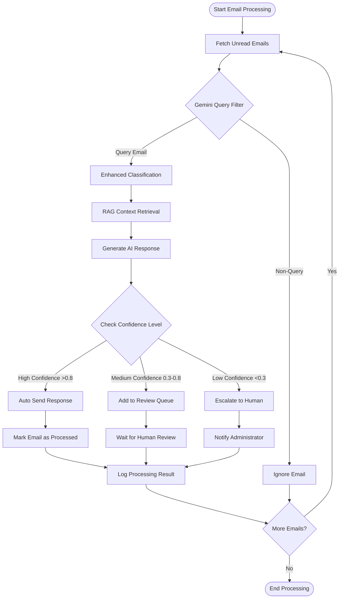
```mermaid
flowchart TD
    Start([Start Email Processing]) --> FetchEmails[Fetch Unread Emails]
    FetchEmails --> GeminiFilter{Gemini Query Filter}
    
    GeminiFilter -->|Non-Query| IgnoreEmail[Ignore Email]
    GeminiFilter -->|Query Email| ClassifyEmail[Enhanced Classification]
    
    ClassifyEmail --> RAGRetrieval[RAG Context Retrieval]
    RAGRetrieval --> GenerateResponse[Generate AI Response]
    
    GenerateResponse --> ConfidenceCheck{Check Confidence Level}
    
    ConfidenceCheck -->|High Confidence >0.8| AutoResponse[Auto Send Response]
    ConfidenceCheck -->|Medium Confidence 0.3-0.8| HumanReview[Add to Review Queue]
    ConfidenceCheck -->|Low Confidence <0.3| Escalate[Escalate to Human]
    
    AutoResponse --> MarkProcessed[Mark Email as Processed]
    HumanReview --> WaitReview[Wait for Human Review]
    Escalate --> NotifyAdmin[Notify Administrator]
    
    MarkProcessed --> LogResult[Log Processing Result]
    WaitReview --> LogResult
    NotifyAdmin --> LogResult
    
    LogResult --> CheckMoreEmails{More Emails?}
    CheckMoreEmails -->|Yes| FetchEmails
    CheckMoreEmails -->|No| End([End Processing])
    
    IgnoreEmail --> CheckMoreEmails
```

### 6.2 RAG System Workflow

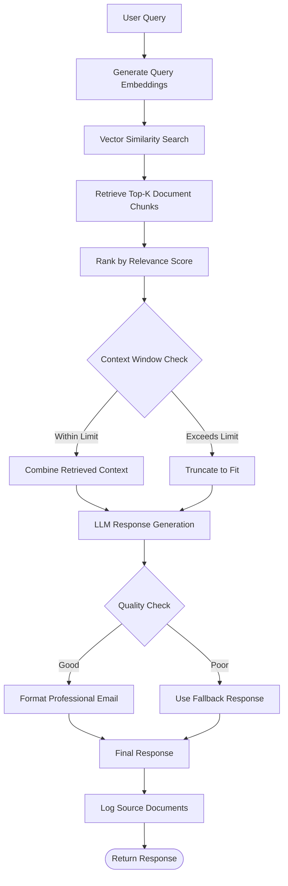
```mermaid
flowchart TD
    Query[User Query] --> Embeddings[Generate Query Embeddings]
    Embeddings --> VectorSearch[Vector Similarity Search]
    
    VectorSearch --> RetrieveChunks[Retrieve Top-K Document Chunks]
    RetrieveChunks --> RankRelevance[Rank by Relevance Score]
    
    RankRelevance --> ContextWindow{Context Window Check}
    ContextWindow -->|Within Limit| CombineContext[Combine Retrieved Context]
    ContextWindow -->|Exceeds Limit| TruncateContext[Truncate to Fit]
    
    CombineContext --> LLMGeneration[LLM Response Generation]
    TruncateContext --> LLMGeneration
    
    LLMGeneration --> ResponseQuality{Quality Check}
    ResponseQuality -->|Good| FormatResponse[Format Professional Email]
    ResponseQuality -->|Poor| Fallback[Use Fallback Response]
    
    FormatResponse --> FinalResponse[Final Response]
    Fallback --> FinalResponse
    
    FinalResponse --> LogSources[Log Source Documents]
    LogSources --> End([Return Response])
```

### 6.3 Multi-Agent Processing Workflow

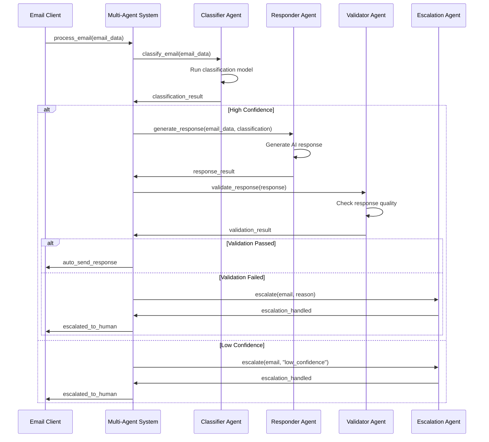
```mermaid
sequenceDiagram
    participant Client as Email Client
    participant MAS as Multi-Agent System
    participant CA as Classifier Agent
    participant RA as Responder Agent
    participant VA as Validator Agent
    participant EA as Escalation Agent
    
    Client->>MAS: process_email(email_data)
    MAS->>CA: classify_email(email_data)
    
    CA->>CA: Run classification model
    CA->>MAS: classification_result
    
    alt High Confidence
        MAS->>RA: generate_response(email_data, classification)
        RA->>RA: Generate AI response
        RA->>MAS: response_result
        
        MAS->>VA: validate_response(response)
        VA->>VA: Check response quality
        VA->>MAS: validation_result
        
        alt Validation Passed
            MAS->>Client: auto_send_response
        else Validation Failed
            MAS->>EA: escalate(email, reason)
            EA->>MAS: escalation_handled
            MAS->>Client: escalated_to_human
        end
    else Low Confidence
        MAS->>EA: escalate(email, "low_confidence")
        EA->>MAS: escalation_handled
        MAS->>Client: escalated_to_human
    end
```

### 6.4 Configuration Management Workflow

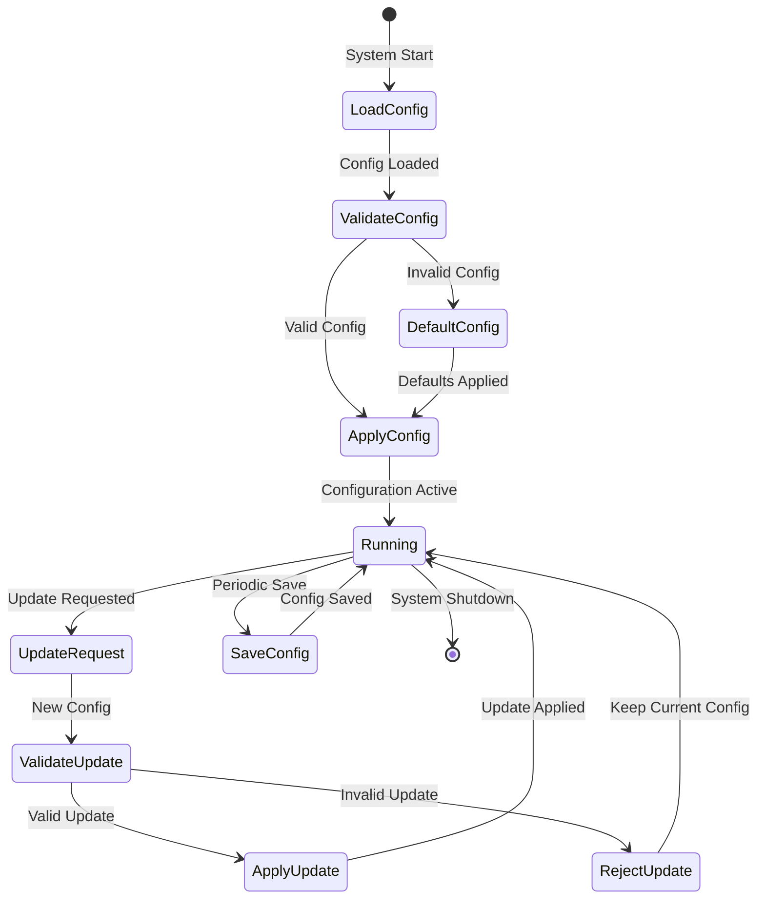
```mermaid
stateDiagram-v2
    [*] --> LoadConfig : System Start
    LoadConfig --> ValidateConfig : Config Loaded
    ValidateConfig --> ApplyConfig : Valid Config
    ValidateConfig --> DefaultConfig : Invalid Config
    DefaultConfig --> ApplyConfig : Defaults Applied
    
    ApplyConfig --> Running : Configuration Active
    
    Running --> UpdateRequest : Update Requested
    UpdateRequest --> ValidateUpdate : New Config
    ValidateUpdate --> ApplyUpdate : Valid Update
    ValidateUpdate --> RejectUpdate : Invalid Update
    ApplyUpdate --> Running : Update Applied
    RejectUpdate --> Running : Keep Current Config
    
    Running --> SaveConfig : Periodic Save
    SaveConfig --> Running : Config Saved
    
    Running --> [*] : System Shutdown
```

---

## 7. API Design

### 7.1 RESTful API Architecture

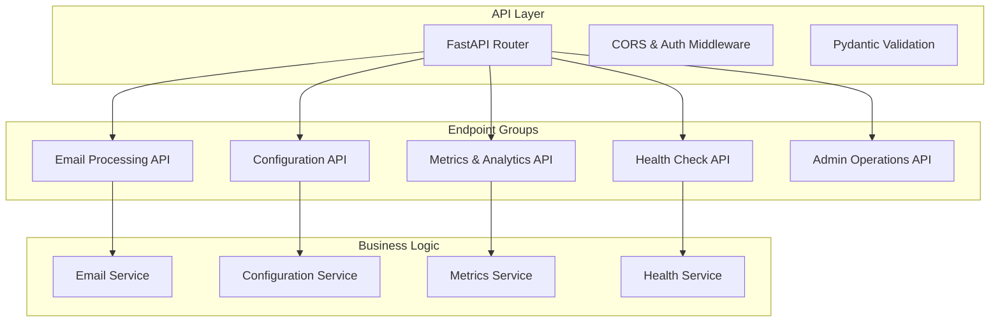
```mermaid
graph TB
    subgraph "API Layer"
        Router[FastAPI Router]
        Middleware[CORS & Auth Middleware]
        Validation[Pydantic Validation]
    end
    
    subgraph "Endpoint Groups"
        EmailAPI[Email Processing API]
        ConfigAPI[Configuration API]
        MetricsAPI[Metrics & Analytics API]
        HealthAPI[Health Check API]
        AdminAPI[Admin Operations API]
    end
    
    subgraph "Business Logic"
        EmailService[Email Service]
        ConfigService[Configuration Service]
        MetricsService[Metrics Service]
        HealthService[Health Service]
    end
    
    Router --> EmailAPI
    Router --> ConfigAPI
    Router --> MetricsAPI
    Router --> HealthAPI
    Router --> AdminAPI
    
    EmailAPI --> EmailService
    ConfigAPI --> ConfigService
    MetricsAPI --> MetricsService
    HealthAPI --> HealthService
```

### 7.2 API Endpoints Specification

#### 7.2.1 Email Processing Endpoints

```yaml
/api/v1/emails:
  GET:
    summary: List processed emails
    parameters:
      - name: limit
        type: integer
        default: 20
      - name: status
        type: string
        enum: [processed, pending, escalated]
    responses:
      200:
        schema: EmailListResponse

  POST:
    summary: Process single email
    requestBody:
      schema: EmailProcessRequest
    responses:
      200:
        schema: ProcessingResult

/api/v1/emails/batch:
  POST:
    summary: Process batch of emails
    requestBody:
      schema: BatchProcessRequest
    responses:
      200:
        schema: BatchProcessingResult

/api/v1/emails/{email_id}/review:
  PUT:
    summary: Update email review status
    parameters:
      - name: email_id
        type: string
    requestBody:
      schema: EmailReviewRequest
    responses:
      200:
        schema: APIResponse
```

#### 7.2.2 Configuration Endpoints

```yaml
/api/v1/config:
  GET:
    summary: Get current configuration
    responses:
      200:
        schema: ConfigResponse

  PUT:
    summary: Update configuration
    requestBody:
      schema: ConfigUpdateRequest
    responses:
      200:
        schema: APIResponse

/api/v1/config/automation:
  POST:
    summary: Start/stop automation
    requestBody:
      properties:
        action:
          type: string
          enum: [start, stop]
    responses:
      200:
        schema: APIResponse
```

### 7.3 Data Transfer Objects (DTOs)

```python
# Request DTOs
class EmailProcessRequest(BaseModel):
    email_content: str
    sender: str
    subject: str
    priority: Optional[str] = "normal"

class ConfigUpdateRequest(BaseModel):
    processing_interval_minutes: Optional[int]
    confidence_thresholds: Optional[Dict[str, float]]
    auto_respond_enabled: Optional[bool]

# Response DTOs
class ProcessingResult(BaseModel):
    email_id: str
    action_taken: EmailAction
    confidence_score: float
    processing_time: float
    ai_response: Optional[str]
    rag_sources: List[str]

class SystemMetrics(BaseModel):
    total_processed: int
    auto_response_rate: float
    average_confidence: float
    processing_status: ProcessingStatus
    last_update: datetime
```

---

## 8. Security & Performance

### 8.1 Security Architecture

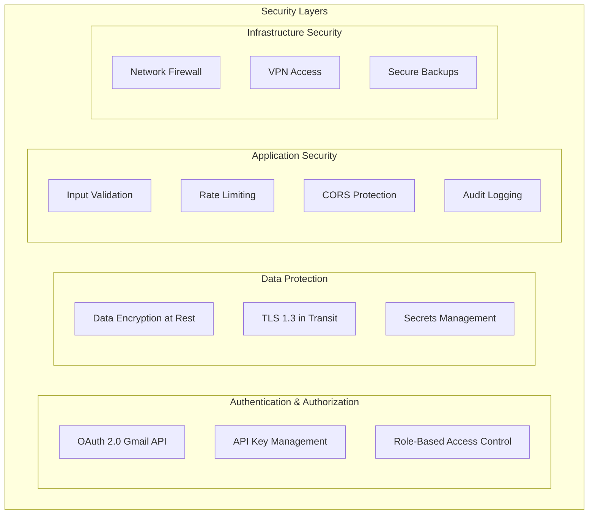
```mermaid
graph TB
    subgraph "Security Layers"
        subgraph "Authentication & Authorization"
            OAuth[OAuth 2.0 Gmail API]
            APIKeys[API Key Management]
            RBAC[Role-Based Access Control]
        end
        
        subgraph "Data Protection"
            Encryption[Data Encryption at Rest]
            TLS[TLS 1.3 in Transit]
            Secrets[Secrets Management]
        end
        
        subgraph "Application Security"
            InputVal[Input Validation]
            RateLimit[Rate Limiting]
            CORS[CORS Protection]
            Audit[Audit Logging]
        end
        
        subgraph "Infrastructure Security"
            Firewall[Network Firewall]
            VPN[VPN Access]
            Backup[Secure Backups]
        end
    end
```

### 8.2 Security Measures

#### 8.2.1 Authentication & Authorization
- **Gmail API**: OAuth 2.0 with proper scope limitations
- **API Access**: API key authentication for external integrations
- **Dashboard Access**: Session-based authentication
- **Admin Operations**: Multi-factor authentication for critical operations

#### 8.2.2 Data Protection
- **Encryption**: AES-256 encryption for sensitive data at rest
- **Transport Security**: TLS 1.3 for all API communications
- **Secrets Management**: Environment-based secret storage
- **Data Anonymization**: PII scrubbing in logs and analytics

#### 8.2.3 Application Security
```python
# Input Validation Example
class EmailValidation:
    @staticmethod
    def validate_email_content(content: str) -> bool:
        # Sanitize and validate email content
        if len(content) > MAX_EMAIL_LENGTH:
            raise ValueError("Email content too long")
        
        # Remove potentially dangerous content
        sanitized = html.escape(content)
        
        # Check for malicious patterns
        if re.search(MALICIOUS_PATTERNS, sanitized):
            raise SecurityError("Potentially malicious content detected")
        
        return True

# Rate Limiting Configuration
RATE_LIMITS = {
    "/api/v1/emails": "100/hour",
    "/api/v1/emails/batch": "10/hour",
    "/api/v1/config": "20/hour"
}
```

### 8.3 Performance Architecture

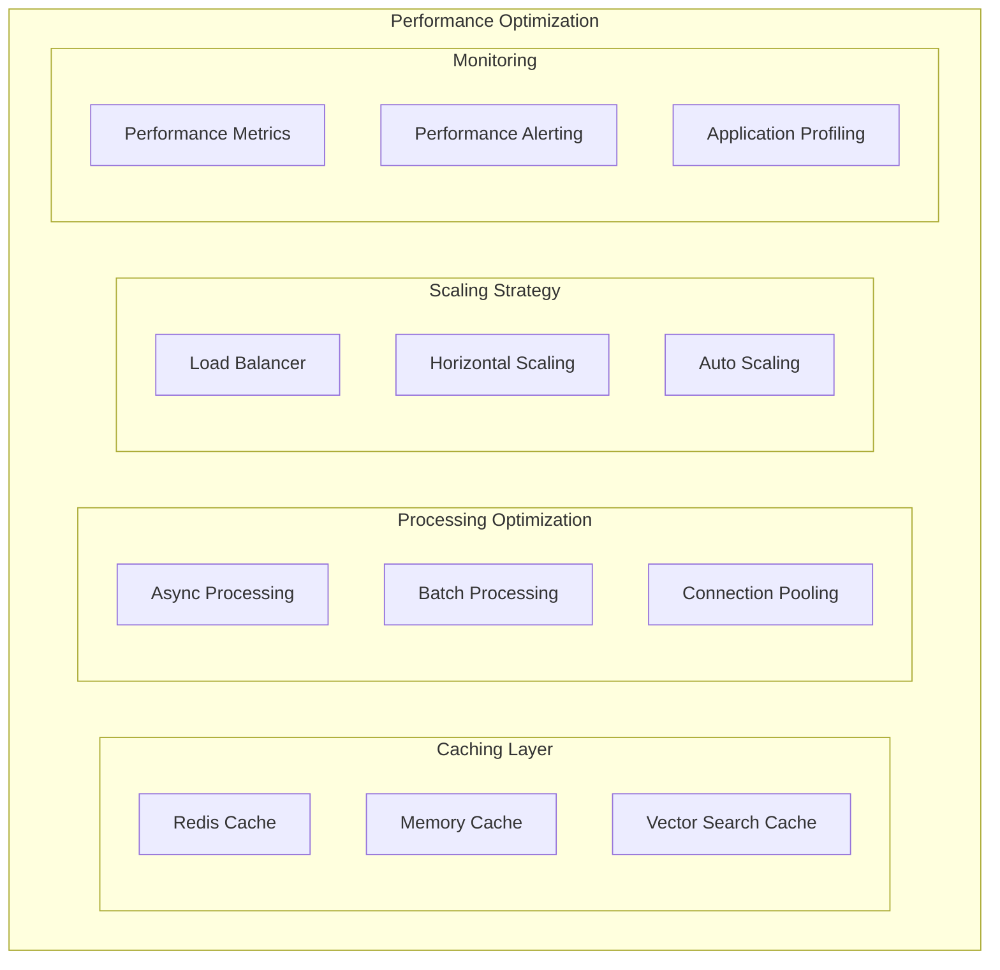
```mermaid
graph TB
    subgraph "Performance Optimization"
        subgraph "Caching Layer"
            Redis[Redis Cache]
            MemCache[Memory Cache]
            VectorCache[Vector Search Cache]
        end
        
        subgraph "Processing Optimization"
            AsyncProc[Async Processing]
            BatchProc[Batch Processing]
            ConnPool[Connection Pooling]
        end
        
        subgraph "Scaling Strategy"
            LoadBalancer[Load Balancer]
            HorizScale[Horizontal Scaling]
            AutoScale[Auto Scaling]
        end
        
        subgraph "Monitoring"
            Metrics[Performance Metrics]
            Alerting[Performance Alerting]
            Profiling[Application Profiling]
        end
    end
```

### 8.4 Performance Specifications

| Metric | Target | Monitoring |
|--------|---------|------------|
| **Response Time** | <2s for API calls | Prometheus metrics |
| **Email Processing** | <5min average | Processing logs |
| **Throughput** | 1000+ emails/day | Daily statistics |
| **Memory Usage** | <4GB per instance | System monitoring |
| **CPU Utilization** | <80% average | Resource monitoring |
| **Availability** | 99.5% uptime | Health checks |

---

## 9. Deployment Architecture

### 9.1 Deployment Options

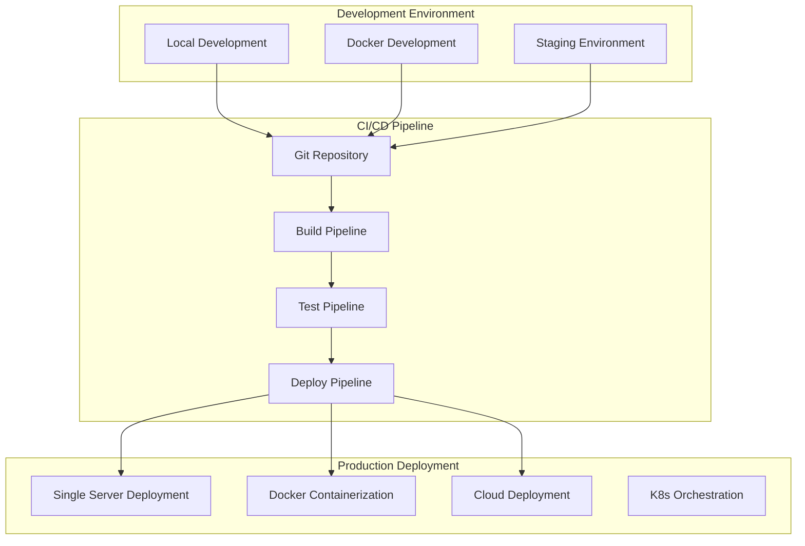
```mermaid
graph TB
    subgraph "Development Environment"
        DevLocal[Local Development]
        DevContainer[Docker Development]
        DevTesting[Staging Environment]
    end
    
    subgraph "Production Deployment"
        SingleServer[Single Server Deployment]
        Containerized[Docker Containerization]
        CloudDeploy[Cloud Deployment]
        Kubernetes[K8s Orchestration]
    end
    
    subgraph "CI/CD Pipeline"
        GitRepo[Git Repository]
        BuildPipeline[Build Pipeline]
        TestPipeline[Test Pipeline]
        DeployPipeline[Deploy Pipeline]
    end
    
    DevLocal --> GitRepo
    DevContainer --> GitRepo
    DevTesting --> GitRepo
    
    GitRepo --> BuildPipeline
    BuildPipeline --> TestPipeline
    TestPipeline --> DeployPipeline
    
    DeployPipeline --> SingleServer
    DeployPipeline --> Containerized
    DeployPipeline --> CloudDeploy
```

### 9.2 Infrastructure Components

#### 9.2.1 Single Server Deployment
```yaml
# docker-compose.yml
version: '3.8'
services:
  d-query-api:
    build: .
    ports:
      - "8000:8000"
    environment:
      - GMAIL_API_KEY=${GMAIL_API_KEY}
      - GEMINI_API_KEY=${GEMINI_API_KEY}
    volumes:
      - ./data:/app/data
      - ./models:/app/models
      - ./logs:/app/logs

  d-query-dashboard:
    build: 
      context: .
      dockerfile: Dockerfile.dashboard
    ports:
      - "8501:8501"
    depends_on:
      - d-query-api

  nginx:
    image: nginx:alpine
    ports:
      - "80:80"
      - "443:443"
    volumes:
      - ./nginx.conf:/etc/nginx/nginx.conf
      - ./ssl:/etc/nginx/ssl
    depends_on:
      - d-query-api
      - d-query-dashboard
```

#### 9.2.2 Kubernetes Deployment
```yaml
# k8s-deployment.yaml
apiVersion: apps/v1
kind: Deployment
metadata:
  name: d-query-system
spec:
  replicas: 2
  selector:
    matchLabels:
      app: d-query
  template:
    metadata:
      labels:
        app: d-query
    spec:
      containers:
      - name: api
        image: d-query/api:latest
        ports:
        - containerPort: 8000
        env:
        - name: GMAIL_API_KEY
          valueFrom:
            secretKeyRef:
              name: d-query-secrets
              key: gmail-api-key
---
apiVersion: v1
kind: Service
metadata:
  name: d-query-service
spec:
  selector:
    app: d-query
  ports:
  - port: 80
    targetPort: 8000
  type: LoadBalancer
```

### 9.3 Environment Configuration

| Environment | Purpose | Configuration |
|-------------|---------|---------------|
| **Development** | Local development and testing | • SQLite database<br>• File-based storage<br>• Debug logging<br>• Mock external APIs |
| **Staging** | Pre-production testing | • PostgreSQL database<br>• Redis caching<br>• Production-like config<br>• Integration testing |
| **Production** | Live system | • Production database<br>• Full monitoring<br>• Load balancing<br>• Auto-scaling |

---

## 10. Monitoring & Maintenance

### 10.1 Monitoring Architecture

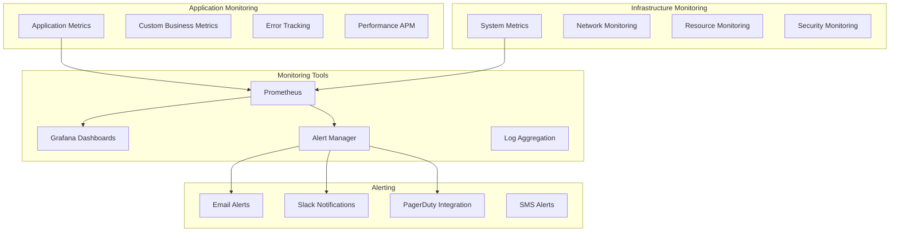
```mermaid
graph TB
    subgraph "Application Monitoring"
        AppMetrics[Application Metrics]
        CustomMetrics[Custom Business Metrics]
        ErrorTracking[Error Tracking]
        PerformanceAPM[Performance APM]
    end
    
    subgraph "Infrastructure Monitoring"
        SystemMetrics[System Metrics]
        NetworkMonitoring[Network Monitoring]
        ResourceMonitoring[Resource Monitoring]
        SecurityMonitoring[Security Monitoring]
    end
    
    subgraph "Monitoring Tools"
        Prometheus[Prometheus]
        Grafana[Grafana Dashboards]
        AlertManager[Alert Manager]
        LogAggregation[Log Aggregation]
    end
    
    subgraph "Alerting"
        EmailAlerts[Email Alerts]
        SlackAlerts[Slack Notifications]
        PagerDuty[PagerDuty Integration]
        SMSAlerts[SMS Alerts]
    end
    
    AppMetrics --> Prometheus
    SystemMetrics --> Prometheus
    Prometheus --> Grafana
    Prometheus --> AlertManager
    
    AlertManager --> EmailAlerts
    AlertManager --> SlackAlerts
    AlertManager --> PagerDuty
```

### 10.2 Key Monitoring Metrics

#### 10.2.1 Business Metrics
- Email processing rate and success rate
- Auto-response accuracy and confidence scores
- Human review queue length and resolution time
- System automation rate and effectiveness

#### 10.2.2 Technical Metrics
- API response times and error rates
- Database query performance and connection pool usage
- Memory and CPU utilization
- Vector search performance and accuracy

#### 10.2.3 Alert Configurations

```yaml
# Alert Rules Example
groups:
- name: d-query-system
  rules:
  - alert: HighErrorRate
    expr: rate(http_requests_total{status=~"5.."}[5m]) > 0.1
    for: 5m
    labels:
      severity: critical
    annotations:
      summary: High error rate detected

  - alert: EmailProcessingStalled
    expr: increase(emails_processed_total[1h]) == 0
    for: 30m
    labels:
      severity: warning
    annotations:
      summary: Email processing appears stalled

  - alert: LowConfidenceSpike
    expr: rate(low_confidence_emails_total[15m]) > 0.3
    for: 10m
    labels:
      severity: warning
    annotations:
      summary: Spike in low confidence classifications
```

### 10.3 Maintenance Procedures

#### 10.3.1 Regular Maintenance Tasks
```python
# Automated Maintenance Script
class MaintenanceTasks:
    def weekly_cleanup(self):
        """Weekly maintenance tasks"""
        # Clean old logs
        self.cleanup_old_logs(days=30)
        
        # Archive processed emails
        self.archive_old_emails(days=90)
        
        # Update model performance metrics
        self.update_model_metrics()
        
        # Validate system configuration
        self.validate_system_config()
    
    def monthly_optimization(self):
        """Monthly optimization tasks"""
        # Retrain embeddings if needed
        self.check_embedding_performance()
        
        # Update knowledge base
        self.update_knowledge_base()
        
        # Performance tuning
        self.optimize_vector_database()
        
        # Security audit
        self.run_security_audit()
```

#### 10.3.2 Disaster Recovery Plan
```mermaid
flowchart TD
    Incident[System Incident] --> Assess[Assess Impact]
    Assess --> Critical{Critical Issue?}
    
    Critical -->|Yes| Failover[Activate Failover]
    Critical -->|No| StandardProcedure[Standard Recovery]
    
    Failover --> NotifyTeam[Notify Emergency Team]
    Failover --> IsolateIssue[Isolate Problem]
    Failover --> RestoreService[Restore Service]
    
    StandardProcedure --> DiagnoseIssue[Diagnose Issue]
    StandardProcedure --> ApplyFix[Apply Fix]
    StandardProcedure --> TestFix[Test Fix]
    
    RestoreService --> ValidateRecovery[Validate Recovery]
    TestFix --> ValidateRecovery
    
    ValidateRecovery --> DocumentIncident[Document Incident]
    DocumentIncident --> PostMortem[Post-Mortem Analysis]
    PostMortem --> UpdateProcedures[Update Procedures]
```

---

## Summary

The D-Query AI Email Automation System represents a sophisticated, production-ready solution for intelligent email processing in educational institutions. The system leverages cutting-edge AI technologies including fine-tuned language models, RAG systems, and multi-agent architectures to provide accurate, context-aware automated responses.

### Key Strengths:
1. **Comprehensive AI Pipeline**: Integration of multiple AI technologies for optimal performance
2. **Scalable Architecture**: Multi-agent system design supporting horizontal scaling
3. **Production-Ready**: Full monitoring, security, and deployment infrastructure
4. **Flexible Configuration**: Extensive customization options for different institutional needs
5. **Human-in-the-Loop**: Balanced automation with human oversight capabilities

### Technology Justification:
The chosen technology stack provides the optimal balance of performance, maintainability, and scalability while leveraging proven, industry-standard components for production deployment.

This system design document provides a complete blueprint for understanding, implementing, and maintaining the D-Query AI Email Automation System at enterprise scale.